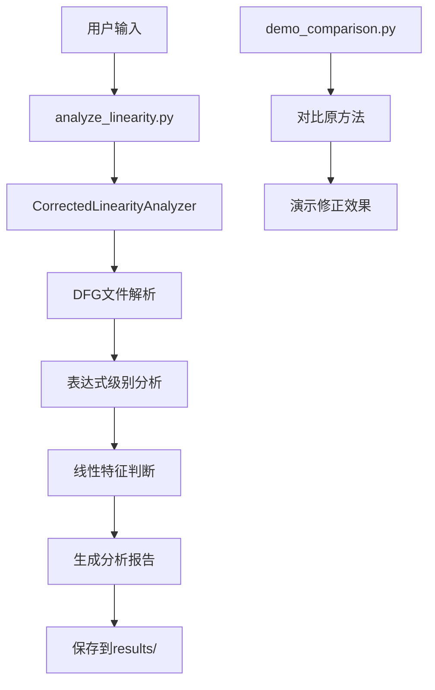

# ESIMULATOR 项目架构文档

## 🏗️ 项目概述

ESIMULATOR是一个专门用于数字电路Data Flow Graph (DFG)线性分析的工具套件。该项目的核心目标是准确分析Intel 4004 ALU等数字电路的线性特征，并将DFG转换为DAG进行信号连接分析。

## 📊 项目重要发现

**关键修正成果**：
- **修正前**：63.2% 线性度（错误的运算符级别统计）
- **修正后**：16.2% 线性度（正确的表达式级别分析）
- **修正幅度**：47个百分点的重大修正！

修正后的结果更准确地反映了Intel 4004 ALU作为非线性数字电路的本质特征。

## 🗂️ 项目文件结构

```
ESIMULATOR/
├── 📁 src/                          # 源代码目录
│   ├── 📁 analyzers/               # 分析器模块
│   │   ├── dfg_linearity_corrector.py    # ⭐ 修正的线性分析器（核心）
│   │   ├── correct_linearity_analyzer.py  # 正确的线性分析器（已弃用）
│   │   ├── analysis_comparator.py         # 分析方法对比器
│   │   ├── signal_connection_analyzer.py  # 信号连接分析器
│   │   ├── expression_tree_analyzer.py    # 表达式树分析器
│   │   ├── dfg_linearity_analyzer.py     # DFG线性分析器（早期版本）
│   │   └── verilog_linearity_analyzer.py # Verilog线性分析器
│   ├── 📁 parsers/                 # 解析器模块
│   │   ├── improved_dfg_parser.py         # 改进的DFG解析器
│   │   ├── dfg_parser.py                  # 基础DFG解析器
│   │   └── dfg_to_python.py              # DFG到Python转换器
│   ├── 📁 visualizers/             # 可视化模块
│   │   ├── dag_structure_visualizer.py   # DAG结构可视化器
│   │   └── signal_visualization.py       # 信号可视化器
│   ├── 📁 utils/                   # 工具模块
│   ├── dfg_to_dag_converter.py     # DFG到DAG转换器
│   ├── dag_structure_analyzer.py   # DAG结构分析器
│   └── improved_dfg_to_dag.py      # 改进的DFG到DAG转换器
├── 📁 dfg_files/                   # 输入数据文件
│   ├── 4004_dfg.txt               # Intel 4004 ALU DFG文件
│   ├── alu1_dfg.txt               # ALU1 DFG文件
│   └── fft_8point_dfg.txt         # 8点FFT DFG文件
├── 📁 verilog_files/               # Verilog源文件
│   ├── 4004.v                     # Intel 4004 Verilog实现
│   ├── alu1.v                     # ALU1 Verilog实现
│   └── fft_8point.v               # 8点FFT Verilog实现
├── 📁 results/                     # 分析结果
│   ├── 📁 data/                    # 结构化数据
│   │   └── 4004_signal_connections.json
│   ├── 📁 reports/                 # 分析报告
│   ├── 📁 visualizations/          # 可视化结果
│   ├── corrected_linearity_analysis.txt  # ⭐ 修正后的分析报告（推荐）
│   └── correct_linearity_analysis.txt    # 原始分析报告（已弃用）
├── 📁 tests/                       # 测试文件
│   └── test_parsing_logic.py       # 解析逻辑测试
├── 📁 docs/                        # 文档目录
│   ├── PROJECT_INDEX.md            # 项目文件索引
│   ├── DFG_to_DAG_Analysis_Summary.md # 项目总结
│   ├── DFG_Linearity_Correction.md    # 线性分析修正说明
│   └── README_DFG_Framework.md         # DFG框架说明
├── 📁 backup_before_reorganize/    # 重构前的备份文件
├── 📁 examples/                    # 示例文件
├── analyze_linearity.py           # ⭐ 主分析入口（推荐使用）
├── demo_comparison.py             # 分析方法对比演示
├── README.md                      # 项目主文档
├── REORGANIZATION_REPORT.md       # 项目重构报告
└── LICENSE                        # 许可证文件
```

## 🔄 模块使用流程

### 主要执行流程



### 详细处理流程

#### 1. **数据输入阶段**
```
dfg_files/4004_dfg.txt → DFG解析器 → 信号表达式列表
```

#### 2. **核心分析阶段**
```python
# 分析流程
analyze_linearity.py
    ↓
CorrectedLinearityAnalyzer.analyze_dfg_file()
    ↓
_analyze_signal_expression() # 对每个信号表达式
    ↓
分类处理:
    ├── Terminal → 线性（直接赋值）
    ├── IntConst → 线性（常量）
    ├── Branch → 非线性（条件分支）
    ├── Concat → 检查子表达式
    └── Operator → 递归分析运算符
    ↓
_generate_comprehensive_report()
    ↓
results/corrected_linearity_analysis.txt
```

#### 3. **结果输出阶段**
```
分析结果 → 报告生成 → 文件保存 → results/目录
```

## 🎯 核心模块详解

### 1. **CorrectedLinearityAnalyzer** (`src/analyzers/dfg_linearity_corrector.py`)
**作用**：修正的线性分析核心引擎
**关键方法**：
- `analyze_dfg_file()` - 分析DFG文件
- `_analyze_signal_expression()` - 表达式级别分析
- `_analyze_operator_expression()` - 运算符表达式分析
- `_generate_comprehensive_report()` - 生成综合报告

### 2. **主入口程序** (`analyze_linearity.py`)
**作用**：用户友好的分析工具入口
**使用方法**：
```bash
python analyze_linearity.py
```

### 3. **对比演示工具** (`demo_comparison.py`)
**作用**：演示修正前后的对比效果
**使用方法**：
```bash
python demo_comparison.py
```

## 📋 使用指南

### 快速开始

1. **运行主要分析**：
```bash
cd /Users/xuxiaolan/PycharmProjects/ESIMULATOR
python analyze_linearity.py
```

2. **查看修正对比**：
```bash
python demo_comparison.py
```

3. **查看分析结果**：
```bash
cat results/corrected_linearity_analysis.txt
```

### 模块导入顺序

如果要在自己的代码中使用：

```python
# 1. 添加路径
import sys
import os
sys.path.insert(0, os.path.join(os.path.dirname(__file__), 'src'))

# 2. 导入核心分析器
from analyzers.dfg_linearity_corrector import CorrectedLinearityAnalyzer

# 3. 创建分析器实例
analyzer = CorrectedLinearityAnalyzer()

# 4. 执行分析
report = analyzer.analyze_dfg_file("dfg_files/4004_dfg.txt")
```

## 🔧 技术架构

### 分析器层次结构
```
CorrectedLinearityAnalyzer (推荐使用)
    ├── 表达式级别分析
    ├── 数学正确性保证
    └── 综合报告生成

CorrectLinearityAnalyzer (已弃用)
    ├── 运算符级别统计
    └── 存在算法缺陷
```

### 数据流
```
DFG文件 → 正则表达式解析 → 表达式树构建 → 线性特征分析 → 统计报告
```

## 📈 分析结果说明

### 输出文件

1. **`results/corrected_linearity_analysis.txt`** ⭐
   - 修正后的正确分析结果
   - Intel 4004 ALU: 16.2% 线性度
   - 推荐查看此文件

2. **`results/correct_linearity_analysis.txt`** ⚠️
   - 原始错误分析结果
   - 63.2% 线性度（错误）
   - 仅用于对比，不推荐使用

3. **`results/data/4004_signal_connections.json`**
   - 信号连接的结构化数据
   - JSON格式，便于进一步处理

### 关键指标

- **总信号数**: 80个
- **线性信号**: 13个 (16.2%)
- **非线性信号**: 67个 (83.8%)
- **主要非线性原因**: 逻辑运算、条件分支

## 🏆 项目成就

1. **算法修正**: 发现并修正了47个百分点的分析误差
2. **方法创新**: 从运算符统计改进为表达式级别分析
3. **数学严谨**: 确保线性定义的数学正确性
4. **工程实用**: 分析结果符合ALU非线性电路的工程实际

## 🔮 扩展性

该项目架构支持：
- 其他DFG文件的分析
- 新的线性分析算法
- 可视化功能扩展
- 批量分析处理

## 📞 使用建议

**推荐工作流程**：
1. 使用 `analyze_linearity.py` 进行分析
2. 查看 `results/corrected_linearity_analysis.txt` 获取结果
3. 使用 `demo_comparison.py` 了解修正效果
4. 参考 `docs/` 目录获取详细文档

**注意事项**：
- 始终使用修正后的分析器（`CorrectedLinearityAnalyzer`）
- 避免使用已弃用的分析方法
- 关注表达式级别而非运算符级别的分析

## 📚 相关文档

- [项目总结报告](docs/DFG_to_DAG_Analysis_Summary.md)
- [线性分析修正说明](docs/DFG_Linearity_Correction.md)
- [项目重构报告](REORGANIZATION_REPORT.md)
- [DFG框架说明](docs/README_DFG_Framework.md)
