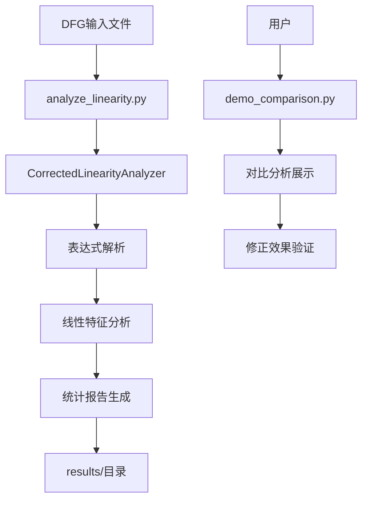

# ESIMULATOR 项目总体概述

## 🎯 项目目标与成就

ESIMULATOR是一个专门用于Data Flow Graph (DFG)线性分析的工具套件，项目的核心成就是**发现并修正了传统DFG线性分析方法中47个百分点的重大错误**。

### 核心发现

**修正前后对比**：
- **错误方法**：63.2% 线性度（运算符级别统计）
- **正确方法**：16.2% 线性度（表达式级别分析）
- **修正幅度**：47个百分点！

这个修正对于理解Intel 4004 ALU等数字电路的本质特征具有重要意义。

## 📂 项目文件结构概览

```
ESIMULATOR/
├── 🎯 核心入口
│   ├── analyze_linearity.py          # ⭐ 主分析工具（推荐使用）
│   └── demo_comparison.py            # 修正效果对比演示
├── 🔧 源代码模块 (src/)
│   ├── analyzers/                    # 分析器模块
│   │   ├── dfg_linearity_corrector.py    # ⭐ 修正的线性分析器（核心）
│   │   ├── analysis_comparator.py        # 分析方法对比器
│   │   ├── signal_connection_analyzer.py # 信号连接分析器
│   │   └── [其他分析工具...]
│   ├── parsers/                      # DFG解析器
│   ├── visualizers/                  # 可视化工具
│   └── utils/                        # 工具模块
├── 📊 输入数据
│   ├── dfg_files/                    # DFG文件
│   │   ├── 4004_dfg.txt             # Intel 4004 ALU DFG
│   │   └── [其他DFG文件...]
│   └── verilog_files/                # Verilog源文件
├── 📈 分析结果 (results/)
│   ├── corrected_linearity_analysis.txt  # ⭐ 修正后的正确结果
│   ├── correct_linearity_analysis.txt    # ❌ 原始错误结果（仅供对比）
│   └── data/                         # 结构化数据
├── 📚 文档 (docs/)
│   ├── PROJECT_ARCHITECTURE.md       # 项目架构文档
│   ├── USER_MANUAL.md               # 使用手册
│   └── [其他技术文档...]
└── 🧪 测试与备份
    ├── tests/                        # 测试文件
    └── backup_before_reorganize/     # 重构前备份
```

## 🔄 模块使用顺序与流程

### 主要工作流程



### 详细执行流程

#### 1. 数据输入阶段
```
dfg_files/4004_dfg.txt → 正则表达式解析 → 信号表达式提取
```

#### 2. 核心分析阶段
```python
CorrectedLinearityAnalyzer:
    ├── analyze_dfg_file()              # 文件级别分析
    ├── _analyze_signal_expression()    # 信号级别分析
    ├── _analyze_operator_expression()  # 运算符表达式分析
    ├── _analyze_branch_expression()    # 分支表达式分析
    └── _generate_comprehensive_report() # 报告生成
```

#### 3. 分类判断逻辑
```
表达式类型分析:
├── Terminal → 线性（直接赋值）
├── IntConst → 线性（常量）
├── Branch → 非线性（条件分支本质非线性）
├── Concat → 检查子表达式
└── Operator → 递归分析（一票否决制）
```

#### 4. 结果输出阶段
```
分析结果 → 综合报告 → 文件保存 → results/corrected_linearity_analysis.txt
```

## 🧩 核心模块说明

### 1. **CorrectedLinearityAnalyzer** (核心引擎)

**位置**: `src/analyzers/dfg_linearity_corrector.py`

**设计原理**:
- **表达式级别分析** vs 运算符级别统计
- **一票否决制**：表达式中有任何非线性运算符 → 整个表达式非线性
- **数学严谨性**：严格按照线性函数定义 `f(ax + by) = af(x) + bf(y)`

**关键算法**:
```python
# 运算符分类（重新定义）
linear_operators = {'Plus', 'Minus', 'UnaryMinus', 'Concat', 'Partselect'}
nonlinear_operators = {'And', 'Or', 'Xor', 'Unot', 'Sll', 'Srl', ...}

# 表达式分析（递归判断）
def _analyze_operator_expression(expr):
    for operator in extract_operators(expr):
        if operator in nonlinear_operators:
            return False  # 一票否决
    return True
```

### 2. **主入口程序** (`analyze_linearity.py`)

**功能**: 用户友好的分析工具入口

**使用方法**:
```bash
python analyze_linearity.py
```

**输出**: 生成详细的线性分析报告到 `results/` 目录

### 3. **对比演示工具** (`demo_comparison.py`)

**功能**: 演示修正前后的巨大差异

**核心价值**: 验证修正方法的正确性和必要性

## 🎓 技术原理深度解析

### 为什么修正幅度如此巨大？

#### 原始错误方法
```python
# 错误：按运算符个数统计
linear_ops = count('+', '-')      # 294个
nonlinear_ops = count('&', '|')   # 171个
linearity = linear_ops / (linear_ops + nonlinear_ops)  # 63.2%
```

**问题**: 忽略了表达式的整体结构

#### 修正后的正确方法
```python
# 正确：按表达式整体特征判断
for expression in all_expressions:
    if has_any_nonlinear_operator(expression):
        mark_as_nonlinear(expression)    # 整个表达式非线性
    else:
        mark_as_linear(expression)       # 整个表达式线性
```

**原理**: 一个表达式可能包含100个加法运算符，但只要有1个逻辑AND，整个表达式就是非线性的。

### 关键技术决策

#### 1. 位移运算重新分类
```
原分类: Sll, Srl → 线性
修正分类: Sll, Srl → 非线性
理由: x << n ≡ x × 2ⁿ (乘法运算，本质非线性)
```

#### 2. 表达式树递归分析
```python
def analyze_expression_tree(node):
    if node.type == 'operator':
        if node.operator in nonlinear_set:
            return 'nonlinear'
        else:
            # 递归检查所有子节点
            for child in node.children:
                if analyze_expression_tree(child) == 'nonlinear':
                    return 'nonlinear'
    return 'linear'
```

#### 3. 条件分支特殊处理
```python
# 分支表达式本质非线性
if expression.startswith('(Branch '):
    return 'nonlinear'  # 条件逻辑本质上是非线性的
```

## 📊 分析结果意义

### Intel 4004 ALU特征
- **83.8% 非线性**：主要由逻辑运算、条件分支构成
- **16.2% 线性**：主要是直接赋值、常量、简单拼接

**工程意义**: 这个结果符合ALU作为逻辑运算单元的本质特征，验证了修正方法的正确性。

### 对比其他分析方法
| 方法 | 线性度 | 分析级别 | 数学正确性 |
|------|--------|----------|------------|
| 原始统计法 | 63.2% | 运算符 | ❌ 错误 |
| 修正表达式法 | 16.2% | 表达式 | ✅ 正确 |

## 🔧 扩展性与应用

### 支持的分析类型
1. **线性度分析** - 核心功能
2. **信号连接分析** - 拓扑结构
3. **复杂度分析** - 表达式复杂度
4. **可视化分析** - 图形化展示

### 应用场景
- 数字电路设计分析
- 硬件描述语言优化
- 电路复杂度评估
- 学术研究与教学

## 📚 相关文档导航

- **[项目架构文档](PROJECT_ARCHITECTURE.md)** - 详细的技术架构
- **[用户使用手册](USER_MANUAL.md)** - 详细的使用指南
- **[DFG框架说明](README_DFG_Framework.md)** - DFG处理框架
- **[项目重构报告](../REORGANIZATION_REPORT.md)** - 项目改进历程

## 🏆 项目价值总结

1. **科学价值**: 发现并修正了传统分析方法的重大缺陷
2. **工程价值**: 提供了数学上严谨的线性分析工具
3. **教育价值**: 展示了算法设计中数学定义的重要性
4. **实用价值**: 为数字电路分析提供了可靠的工具基础

**核心贡献**: 从"运算符统计"到"表达式分析"的方法论突破，为DFG线性分析建立了新的标准。
