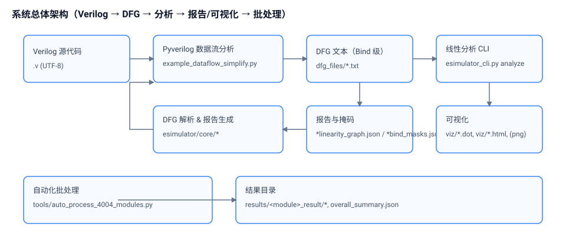
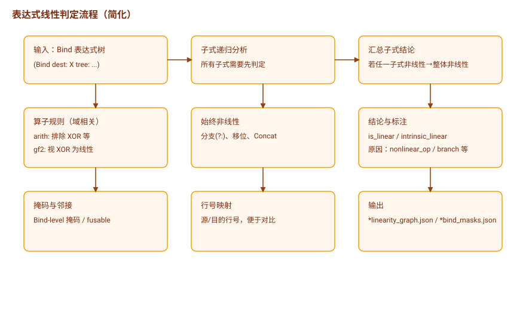
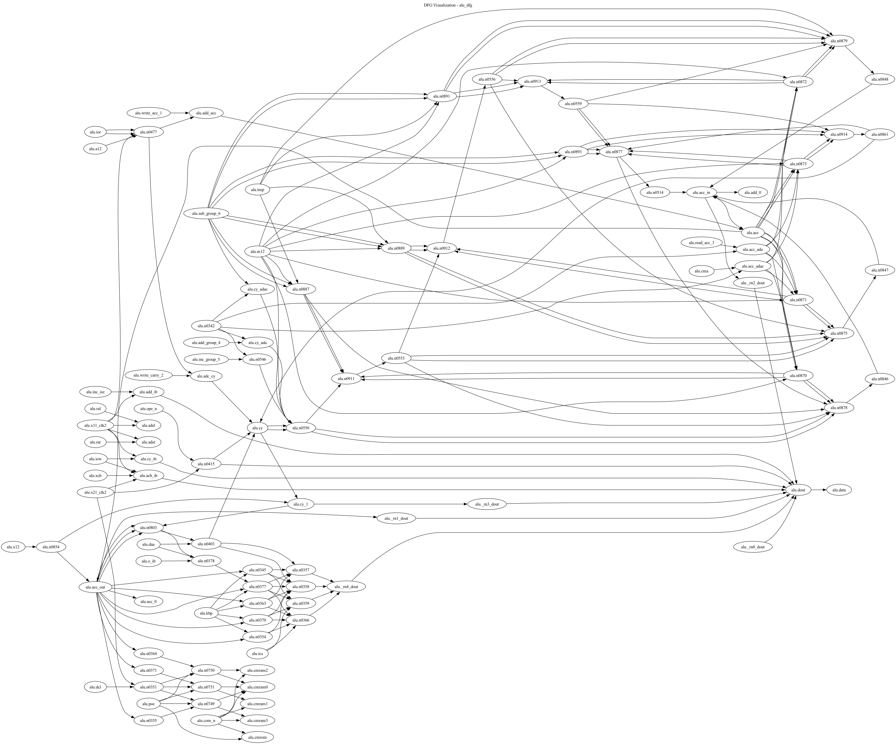
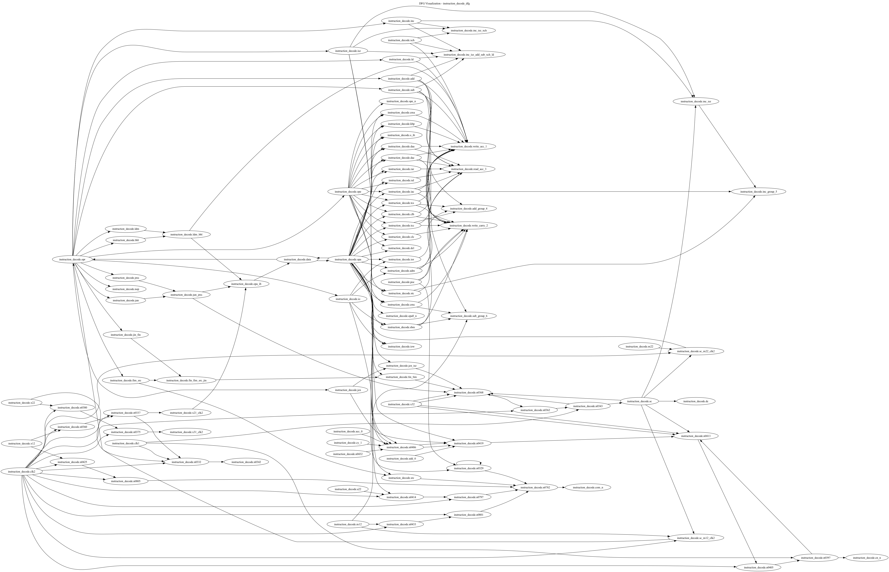
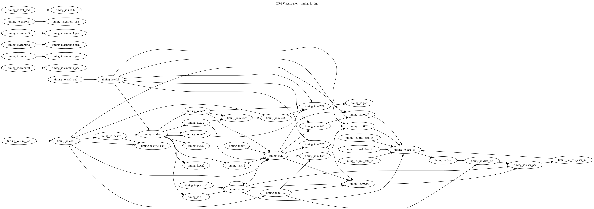

# 基于数据流图（DFG）的数字电路线性特性分析

## 1. 技术名称

基于数据流图（DFG）的数字电路表达式线性特性分析、掩码标注与可视化系统及其自动化处理方法。

## 2. 技术领域

本技术涉及电子设计自动化（EDA）与硬件安全/可验证性分析领域，尤其涉及对 Verilog HDL 描述的数字电路在数据流层面的绑定（Bind）级表达式进行线性/非线性判定、标注与可视化，以及面向大规模模块的自动化批处理与报告生成。

## 3. 背景技术

数字电路的线性/非线性性质直接影响到电路的可综合性、可验证性、以及后续优化。现有方法多从门级网表或布尔函数层面分析，缺少一种以数据流图（DFG）绑定级粒度、包含源/目的代码行信息的全面分析与可视化方案，难以在不降级为门级复杂度的情况下快速给出“可视化可解释”的线性标注结果。

## 4. 要解决的技术问题

1) 如何在 Bind 级别（目标信号到表达式树）对表达式整体进行线性/非线性判定，并给出成因解释（运算符、分支结构等）。
2) 如何输出包含节点/边标注、掩码与行号映射的机器可读 JSON，以支撑后续自动化处理与可视化。
3) 如何区分不同数学域（算术域 arith 与 GF(2) 域）下的线性性差异，并可配置地扩展运算符集合。
4) 如何对多模块进行自动化批处理（DFG 生成→分析→对比→可视化），提供统一的产出与汇总。
5) 如何对真实工程代码的编码差异（非 UTF-8）与顺序逻辑占比高的模块进行鲁棒处理。

## 5. 技术方案

### 5.1 总体架构

系统由以下组件构成：

- DFG 生成：基于 Pyverilog 的数据流分析脚本（example_dataflow_simplify.py）对 Verilog 源生成 Bind 级 DFG 文本。
- DFG 解析：`esimulator/core/dfg_parser.py` 提取 “(Bind dest: … tree: …)” 结构，构建内部表示。
- 线性分析：`src/analyzers/dfg_linearity_corrector.py` 对表达式树递归判定线性/非线性，导出包含掩码、线性标注、邻接关系与代码行号的 JSON。
- 报告生成：`esimulator/core/report_generator.py` 汇总图结构与标注，输出 `*_linearity_graph.json` 与 `*_bind_masks.json` 等。
- 命令行接口：`esimulator_cli.py` 提供 analyze / compare-signals / visualize / batch 等子命令。
- 可视化：`esimulator/visual/__init__.py` 从 DFG 文本构建依赖图，输出 DOT/HTML；配合 Graphviz 可转为 PNG。
- 自动化批处理：`tools/auto_process_4004_modules.py` 一键完成多模块 DFG 生成、分析、对比与可视化，并生成总体汇总。

### 5.2 方法步骤（流程）

1) DFG 生成：对目标模块 m 与源文件 v 运行 Pyverilog 脚本，得到 `dfg_files/<m>_dfg.txt`。
2) DFG 解析：解析 Bind 列表，提取每个目标信号的表达式树字符串。
3) 线性分析：对每个 Bind 的表达式树进行递归分析，输出：
   - 线性性判定（布尔）、内在线性标记（intrinsic_linear）。
   - 触发非线性的原因枚举（非线性算子、条件分支、移位、串接等）。
   - 融合/可融合邻接信息与掩码（Bind-level）。
   - 源/目的代码行号映射（用于溯源与对比）。
4) 报告生成：输出 `linearity_analysis.json`、`*_linearity_graph.json`、`*_bind_masks.json`。
5) 信号覆盖对比（可选）：统计 Verilog 名称、DFG 绑定数、覆盖率等，输出 `*_signal_compare.json`。
6) 可视化（可选）：输出 DOT/HTML；可使用 `dot` 渲染为 PNG。
7) 批处理（可选）：按模块列表自动执行 1)~6)，并写入 `results/overall_summary.json`。

### 5.3 核心算法：表达式线性判定

1) 递归策略：
   - 终端（Terminal/Var/IntConst）视为线性起点；常量为线性。
   - 组合算子根据运算符集判定：若任一子式非线性，整体非线性；否则根据运算符性质决定。
2) 运算符规则（示例，当前版本）：
   - 始终非线性：条件分支（Branch/Cond/?:）、串接（Concat）、移位（LSHIFT/RSHIFT/ARSHIFT 等）。
   - 线性候选（可在不同域下配置）：XOR、加法在 GF(2) 下等价（可选）；AND/OR 在算术域通常非线性。

伪代码片段：

```python
def is_linear(node, mode):
  if node.type in {Terminal, IntConst}: return True
  if node.type in {Branch, Concat, Shift}: return False
  child_lin = all(is_linear(c, mode) for c in node.children)
  if not child_lin: return False
  return op_is_linear(node.op, mode)
```

### 5.4 数据结构与文件格式

1) DFG 输入文本（示例）：

```text
(Bind dest: module.signal tree: (Operator Add Next: (Terminal a) (Terminal b) ...))
```

### 5.5 可视化方案

`esimulator/visual/__init__.py` 实现基础可视化：

- 从 DFG 文本按 Bind 抽取 Terminal 引用，建立依赖边（Terminal → dest）。
- 输出 DOT 与 HTML；可执行 `dot -Tpng file.dot -O` 产出 PNG。
- 预留 focus/depth/filter 参数，后续可扩展子图与过滤视图（如仅展示线性/非线性子图）。

### 5.6 批处理与自动化

`tools/auto_process_4004_modules.py` 提供一键流程：

- 输入：模块列表（默认 alu、instruction_decode、timing_io）、Pyverilog 脚本路径、源/DFG/结果目录、线性模式等。
- 步骤：DFG 生成 → 分析 → 可选 compare-signals → 可选 visualize（并可转 PNG）。
- 健壮性：
  - `--recode-utf8` 可在 Pyverilog 前尝试将 Verilog 源重编码为 UTF-8（保存 .bak 备份）以消解 0xA9 等字符问题。
  - 单模块异常不影响整批；最终写入 `results/overall_summary.json`。

示例命令（macOS zsh）：

```sh
python tools/auto_process_4004_modules.py \
  --pyverilog-example /Users/xuxiaolan/PycharmProjects/Pyverilog/examples/example_dataflow_simplify.py \
  --verilog-dir 4004_full_verilog \
  --dfg-dir dfg_files \
  --results-dir results \
  --modules alu,instruction_decode,timing_io \
  --linearity-mode arith \
  --recode-utf8 \
  --visualize \
  --render-png
```

### 5.7 与 ONN 模块联合设计与仿真的前导作用

本技术在与后续 ONN（如光学/模拟阵列/片上神经网络）模块的联合设计与协同仿真中，承担“先验分析与约束生成”的前导角色：

- 线性可映射性判定：Bind 级的 workset_mask 与 intrinsic_mask 明确标注哪些子表达式在所选数学域下可视为线性，天然对应 ONN 核（矩阵-向量乘、逐点线性运算）的可映射候选。
- 边界与切分：对 Branch/Concat 等非线性结构的显式标注，形成天然的分区/切分边界；fusable_adj 给出可融合的线性链段，便于生成 ONN tile/簇的初始分组与拼接策略。
- 追溯与插桩：dest/source 的行号映射为联合调试提供“代码到电路到子图”的可追溯通道，便于在 RTL 与 ONN 模块间对齐波形与插桩定位差异。
- 协同仿真基线：linearity_graph.json 与 bind_masks.json 可直接驱动测试向量生成与等价性校验（golden RTL vs. ONN 子模块），在映射前给出覆盖面与风险提示（nonlinear_reasons 与 operator_count）。


## 6. 有益效果

1) 绑定级（Bind-level）整体判定，符合工程师对“信号等式”的直觉表达，解释性更强。
2) JSON 导出包含线性标注、掩码、邻接与行号，便于后续可视化、对比与自动化汇总。
3) 支持按数学域（arith / gf2）配置运算符线性集合，便于研究差异性影响。
4) 可视化输出轻量、可嵌入报告；批处理脚本便于对多模块（如 4004 系列）形成一致报告。
5) 具备编码鲁棒性与错误隔离，适合真实工程代码处理。
6) 为 ONN 联合设计提供前导分析与可执行约束：在线性可映射性、切分边界、簇内融合与等价性校验上给出直接输入，缩短从 RTL 到 ONN 子模块的闭环时间。

## 7. 附图说明（图在文末）

图1 系统总体架构示意图（DFG 生成→解析→线性分析→报告→可视化→批处理）。

图2 表达式线性判定流程图（递归遍历、算子规则、域模式选择、成因输出）。

图3 可视化产物示意（DOT/HTML/PNG）。

## 8. 具体实施方式

### 8.1 实例一（ALU 模块）

流程：重编码（可选）→ DFG 生成 → analyze → 可视化。
说明：若原始文件包含非 UTF-8 字符（如版权符号），使用 `--recode-utf8` 自动转换并备份。

### 8.2 实例二（instruction_decode 模块）

在一次典型运行中，系统报告类似：

- 总表达式数约 85；线性 3，非线性 82；主要非线性来自非线性算子与条件分支。
- compare-signals 报告统计 Verilog 信号与 Bind 覆盖量，输出 TXT 与 JSON。

### 8.3 实例三（timing_io 模块）

在一次典型运行中，系统报告类似：

- 总表达式数约 39；线性 9，非线性 30；主要非线性来自分支、未识别表达式与少量非线性算子。

### 8.4 说明（顺序逻辑占比高的模块）

当模块以顺序逻辑为主（如 instruction_pointer），若仅抽取组合绑定，可能出现 Bind 稀少或为零的情况；可通过改进 DFG 生成策略（如纳入寄存器 RHS）或选择组合逻辑更丰富的模块（如 timing_io）进行对比分析。

## 9. 主要作用创新点（后续这里稍微更改一下，形成权利要求）

方法类：

- 一种基于 DFG 的数字电路表达式线性分析方法，包括：
  1) 基于数据流分析从 Verilog 源生成包含 Bind 的 DFG 文本；
  2) 解析各 Bind 的表达式树；
  3) 按预设运算符规则与数学域模式对表达式整体进行线性/非线性判定；
  4) 生成包含线性标注、掩码、邻接与行号映射的 JSON；
  5) 输出可视化产物与批处理汇总。

系统/装置类：

- 包括 DFG 生成模块、DFG 解析模块、线性分析模块、报告生成模块、可视化模块与批处理模块，各模块之间的输入输出关系如架构所示。

## 10. 应用场景

- Verilog代码拆分与进一步的线性/非线性特性评估。
- 高层综合与优化中的线性约束抽取与变换机会识别。
- 为后续工具链提供入口和原料文件。
- 教学/演示用的可视化报告生成。
- ONN 加速器联合设计与共仿：将高线性度子图映射至 ONN（光学/模拟阵列/类脑）核，利用 bind_masks.json/linearity_graph.json 进行映射前校验、约束生成与等价性仿真回放。

## 11. 运行环境与依赖

- 操作系统：macOS,Linux。
- 语言与版本：Python 3.10。
- 依赖：Pyverilog（解析/数据流）、Graphviz（可选，DOT→PNG）。
- 项目入口：`esimulator_cli.py`；自动化脚本：`tools/auto_process_4004_modules.py`。

## 12. 附录

### 12.1 主要命令

分析（从 DFG 与 Verilog 出发）：

```sh
python esimulator_cli.py analyze <dfg_file> \
  --output <out_dir> --format json \
  --linearity-mode <arith|gf2> --verilog-file <verilog.v> \
  --module-prefix <module.或空>
```

信号对比：

```sh
python esimulator_cli.py compare-signals <dfg_file> \
  --verilog-file <verilog.v> --module-prefix <prefix> \
  --output <out_dir> --linearity-mode <arith|gf2>
```

可视化（DOT/HTML）：

```sh
python esimulator_cli.py visualize <dfg_file> --output <viz_dir>
```

批处理（推荐）：

```sh
python tools/auto_process_4004_modules.py \
  --pyverilog-example /path/to/example_dataflow_simplify.py \
  --verilog-dir 4004_full_verilog \
  --dfg-dir dfg_files \
  --results-dir results \
  --modules alu,instruction_decode,timing_io \
  --linearity-mode arith \
  --recode-utf8 \
  --visualize \
  --render-png
```

### 12.2 可扩展点

- 运算符线性集合的模式化配置（arith/gf2 等），以差异化对照实验。
- Concat/Partselect 等结构的域相关建模与更细粒度掩码。
- 可视化过滤（linear-only / nonlinear-only）、焦点与深度限定子图。
- DFG 生成纳入时序右值路径（可配置），用于顺序逻辑占比高的模块。


## 图例

- 图1 系统总体架构示意图

  

- 图2 表达式线性判定流程图

  

- 图3 模块可视化样例（自动生成 PNG）

  - 图3-1 ALU 模块 DFG 可视化

    

  - 图3-2 instruction_decode 模块 DFG 可视化

    

  - 图3-3 timing_io 模块 DFG 可视化

    
